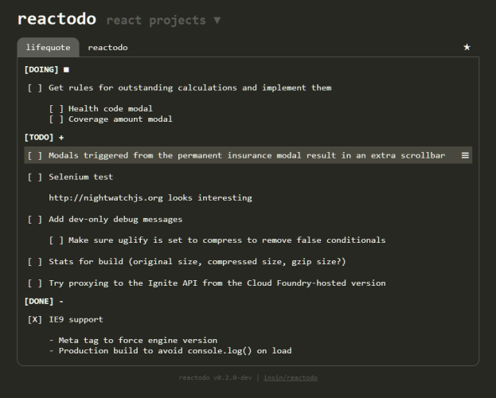

# reactodo

Multiple localStorage TODO lists, built with [React](http://facebook.github.io/react)

* http://insin.github.io/reactodo/

Designed and styled after quick, disposable TODO tracking of the type commonly
done in a programmer's text editor, but with a few interactive niceties to
manage items instead of cut + paste.



## Build

Install dependencies:

```
npm install
```

Develop:

```
npm run dev
```

Production build:

```
npm run dist
```

## MIT Licensed
